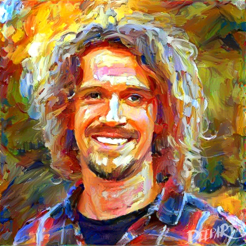

### Hi there 👋

<!--  -->

I am Markus. 
Having acquired a PhD in climate science from the University of Hamburg and the Max Planck Institute for Meteorology in Germany, coding has been an essential part of my daily life, both for my professional work and for private projects. 
Here on GitHub, I share most of my projects, openly accessible. 
I'm doing my best to follow good coding standards but beg for pardon if I don't always succeed, having acquired most of my coding skills autodidacticly ;-)

***

